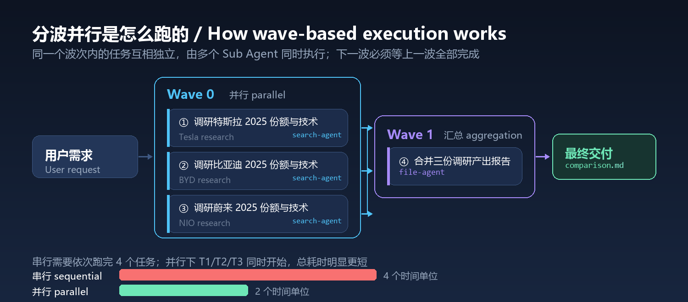
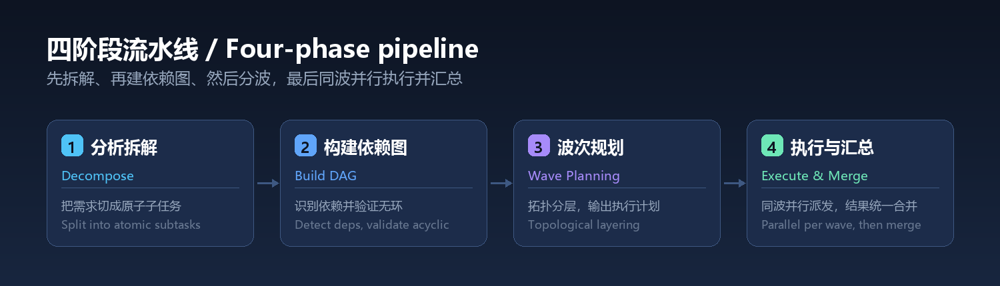
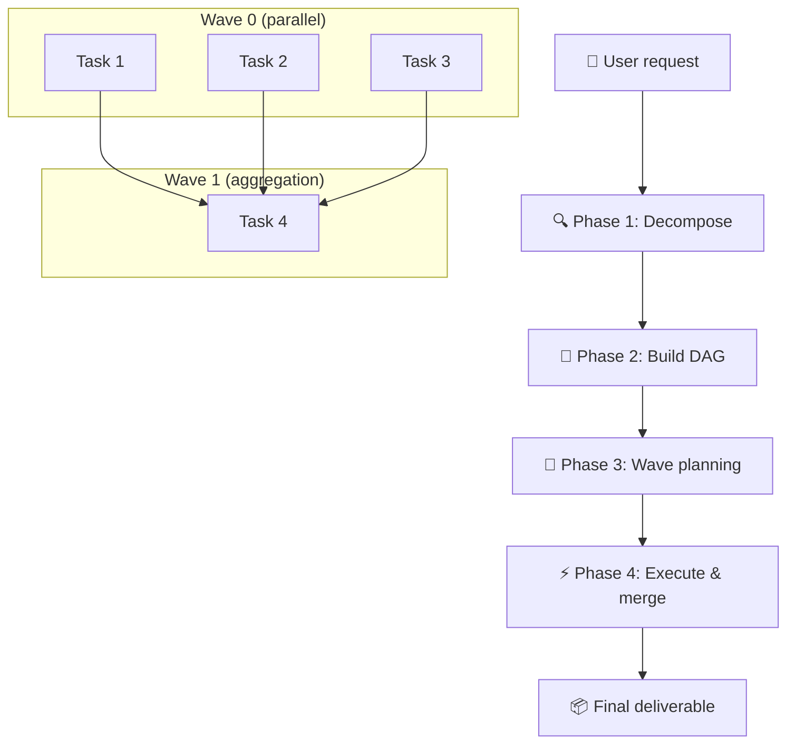

<div align="center">



**Stop doing one thing at a time. Decompose, parallelize, orchestrate.**

[](LICENSE)
[](CHANGELOG.md)
[](https://github.com/YardonYan/task-skill-orchestrator)
[](#platform)
[](#file-structure)

[中文](README.md) · **English**

</div>

---

> A skill that decomposes a complex request into a dependency-aware DAG of subtasks, dispatches independent subtasks in parallel waves to multiple Sub Agents, and aggregates the results into a single deliverable.

## Table of Contents

- [The Problem](#the-problem)
- [How It Works](#how-it-works)
- [Core Capabilities](#core-capabilities)
- [Platform](#platform)
- [Installation](#installation)
- [Ways to use it](#ways-to-use-it)
- [Triggers](#triggers)
- [Examples](#examples)
- [File Structure](#file-structure)
- [Running the Example](#running-the-example)
- [Troubleshooting](#troubleshooting)
- [License](#license)

---

<a id="the-problem"></a>

## The Problem

When an AI hits a complex request — "research three companies and merge the findings into a report", or "tidy my desktop, clear system junk, and back up important files" — the default behaviour is sequential: do A, then B, then C, with a wait in between each step.

The real bottleneck isn't that any single task is slow. It's that the tasks don't actually depend on each other, yet they get queued up in a line.

**Task Orchestrator changes this.** It analyses the request, splits it into atomic subtasks, works out what depends on what, builds a directed acyclic graph (DAG), and dispatches independent subtasks in parallel waves. The result: shorter wall-clock time, clearer structure, and verifiable intermediate output at every step.

<a id="how-it-works"></a>

## How It Works



The pipeline has four phases:

1. **Decompose.** Split the request into atomic subtasks of sensible granularity, marking which are independent and which have dependencies.
2. **Build the DAG.** Detect data, temporal, and logical dependencies, construct the graph, and validate that it contains no cycles.
3. **Wave planning.** Topologically layer the DAG — tasks in the same layer are mutually independent and form one wave. The resulting plan is presented for confirmation.
4. **Execute and merge.** Every task in a wave is dispatched to its own Sub Agent simultaneously. Once all of them return, results are verified, and the next wave begins. Finally everything is merged into one deliverable.



The mechanism in one sentence: **tasks within a wave run in parallel; waves run in sequence.**

<a id="core-capabilities"></a>

## Core Capabilities

- **Automatic decomposition** — parses a complex request and splits it into atomic subtasks with no manual planning.
- **Dependency-aware DAG** — identifies data, temporal, and logical dependencies, then builds and validates a directed acyclic graph.
- **Parallel wave dispatch** — groups mutually independent subtasks into a wave and runs them concurrently across multiple Sub Agents.
- **Result aggregation** — collects every subtask's output, handles failed branches gracefully, and merges everything into one deliverable.
- **Multi-agent routing** — routes each subtask to the right Sub Agent automatically (file-agent, search-agent, browser, app-agent, computer-agent).

<a id="platform"></a>

## Platform

**Primary**: OpenClaw (dispatches sub-agents via `sessions_spawn`).

Adaptable to Claude Code or any other platform with sub-agent support. The platform-agnostic DAG engine lives in `scripts/orchestrate.py`.

<a id="installation"></a>

## Installation

### Using the installer (recommended)

The repo ships a zero-dependency installer that copies the skill into the skills directory of each AI app on your machine:

```bash
node tools/install.mjs --list                 # list available targets
node tools/install.mjs --ai openclaw          # install into OpenClaw
node tools/install.mjs --ai workbuddy --ai trae-cn   # several at once
node tools/install.mjs --ai all               # every target
node tools/install.mjs --ai all --dry-run     # preview only, writes nothing
node tools/install.mjs --ai openclaw --uninstall    # remove
```

Targets verified to exist on a real machine: OpenClaw, WorkBuddy, TRAE China edition, CodeBuddy, Claude Code, Codex CLI, Qwen Code, cc-switch. `cursor` and the generic `.agents` target use the conventional path and have not been verified.

### Installing as a plugin (WorkBuddy / CodeBuddy / Claude Code)

The repository root carries `.codebuddy-plugin/` and `.claude-plugin/` manifests, so it can be registered directly as a single-plugin marketplace and installed as a plugin rather than by copying directories.

The field names and values follow the manifests shipped inside the apps themselves — this is not a format of my own invention. **The file format was checked field by field against the apps' own bundled marketplaces; the end-to-end register-and-load flow has not been verified.** Where you register it depends on the version you have.

Regenerate the manifests after changing the `name` or version in `SKILL.md`:

```bash
node tools/build_plugins.mjs .
```

### Manual installation for OpenClaw

```bash
# macOS / Linux
cp -r task-skill-orchestrator ~/.qclaw/skills/
```

```powershell
# Windows (PowerShell)
Copy-Item -Recurse task-skill-orchestrator $env:USERPROFILE\.qclaw\skills\
```

Or via SkillHub:

```bash
openclaw skill install task-skill-orchestrator
```

<a id="triggers"></a>

## Ways to use it

How you install this depends on which AI assistant you use. Installing into several on the same machine is fine — they do not conflict.

### One command, any assistant

The repo ships a zero-dependency installer, so there is no manual directory copying:

```bash
git clone https://github.com/YardonYan/task-skill-orchestrator.git
cd task-skill-orchestrator
node tools/install.mjs --list          # list the targets available on this machine
node tools/install.mjs --ai workbuddy  # install into one
node tools/install.mjs --ai all        # install into all of them
```

### Where each assistant looks

| Target id | Assistant | Global directory | Per-project directory |
| --- | --- | --- | --- |
| `workbuddy` | WorkBuddy | `~/.workbuddy/skills` | `.workbuddy/skills` |
| `trae-cn` | TRAE China edition | `~/.trae-cn/skills` | `.trae-cn/skills` |
| `codebuddy` | CodeBuddy | `~/.codebuddy/skills` | `.codebuddy/skills` |
| `claude` | Claude Code | `~/.claude/skills` | `.claude/skills` |
| `codex` | Codex CLI | `~/.codex/skills` | `.codex/skills` |
| `openclaw` | OpenClaw | `~/.openclaw/workspace/skills` | `.openclaw/skills` |
| `qwen` | Qwen Code | `~/.qwen/skills` | `.qwen/skills` |
| `cc-switch` | cc-switch | `~/.cc-switch/skills` | `.cc-switch/skills` |
| `cursor` | Cursor | `~/.cursor/skills` | `.cursor/skills` |
| `agents` | Generic agent standard | `~/.agents/skills` | `.agents/skills` |

Without a flag it installs globally (available to every project); add `--project` to install into relative directories inside the current project, which suits committing it alongside the code.

### Installing as a plugin

The repository root carries four sets of plugin manifests, so a supporting assistant can install it directly instead of copying directories:

| Assistant | Manifest | How |
| --- | --- | --- |
| Claude Code | `.claude-plugin/` | `/plugin marketplace add YardonYan/task-skill-orchestrator` then `/plugin install task-skill-orchestrator@YardonYan-task-skill-orchestrator` |
| WorkBuddy / CodeBuddy | `.codebuddy-plugin/` | Add this repository path or URL under marketplace settings |
| Codex | `.codex-plugin/` | Follow Codex's plugin install flow, pointing at this repository |
| Cursor | `.cursor-plugin/` | `/add-plugin`, or search the plugin marketplace |

The field names and values follow the manifests shipped inside each assistant — this is not a format of my own invention. **The manifest files were checked field by field; the register-and-load flow has not been verified end to end.** Where you register it depends on the version you have.

### Where it does not apply

A few environments get asked about but have no mechanism for this. Listed here so nobody wastes time:

| Environment | Situation |
| --- | --- |
| Browser IDEs (CodeSandbox, StackBlitz, Replit) | A skill is an instruction file for an AI assistant, not a runnable app — these environments have no entry point for loading one |
| Cloud shells (Google Cloud Shell, AWS CloudShell) | Same as above. If you only want to run the repo's scripts, `git clone` and run the documented commands; that is unrelated to skill loading |
| Uploading the repository ZIP to an assistant's skill upload dialog | The repo includes references and scripts, which may exceed file-count limits; the installer or a plugin marketplace is more reliable |
| Mobile | The assistants above have no meaningful mobile client |

---

## Triggers

Any of the following phrases will activate the skill:

| English | Chinese |
|---------|---------|
| handle these in parallel | 并行处理 |
| do all of these at once | 同时做这些 |
| split this task | 拆任务 |
| multi-thread this | 多线并进 |
| batch execute | 批量执行 |
| decompose this complex task | 复杂任务拆解 |

<a id="examples"></a>

## Examples

Example 1 — with dependencies:

```
User: Research Tesla, BYD, and NIO's 2025 market share, core technology, and latest
      financials, then merge everything into a comparison report.

Agent:
Decomposition complete. 4 subtasks, 2 waves.

Wave 0 (parallel, 3 tasks):
  ① Research Tesla 2025 market share, core tech, financials → search-agent
  ② Research BYD   2025 market share, core tech, financials → search-agent
  ③ Research NIO   2025 market share, core tech, financials → search-agent

Wave 1 (aggregation, depends on all of Wave 0):
  ④ Merge the three research results into a comparison report → file-agent

Proceed with execution?

User: go

[Agent dispatches ①②③ in parallel, waits for all to return, then dispatches ④]
[Output: car_companies_comparison_report.md]
```

Example 2 — fully independent:

```
User: Do three things at once for me: tidy my desktop files, clear system junk,
      and back up important files from D: to E:

Agent:
Decomposition complete. 3 subtasks, 1 wave.
(All three are independent — no dependencies.)

Wave 0 (parallel, 3 tasks):
  ① Tidy desktop files → file-agent
  ② Clear system junk → computer-agent
  ③ Back up important files from D: to E: → file-agent

Proceed with execution?
```

<a id="file-structure"></a>

## File Structure

```
task-skill-orchestrator/
├── SKILL.md                  # Core skill instructions
├── .codebuddy-plugin/              Plugin manifests (WorkBuddy / CodeBuddy)
├── .codex-plugin/                  Plugin manifest (Codex)
├── .cursor-plugin/                 Plugin manifest (Cursor)
├── .claude-plugin/                 Plugin manifests (Claude Code)
├── README.md                 # Chinese README
├── README.en.md              # English README (this file)
├── CHANGELOG.md              # Version history
├── CONTRIBUTING.md           # Contribution guide
├── LICENSE                   # Apache-2.0 license
├── meta.json                 # Skill metadata
├── assets/
│   ├── dag-waves.png         # Wave-based execution diagram
│   └── pipeline.png          # Four-phase pipeline diagram
├── examples/
│   └── parallel_research.py  # Runnable example demonstrating the DAG logic
├── scripts/
│   └── orchestrate.py        # Platform-agnostic DAG engine
├── tests/
│   └── test_orchestrator.py  # Unit tests for the DAG logic
└── tools/
│  ├── gen_readme_images.py  # Generates README images (Pillow)
│  └── build_plugins.mjs       Generates plugin manifests
```

<a id="running-the-example"></a>

## Running the Example

```bash
cd examples
python parallel_research.py
```

Output:

```
============================================================
User request: Research Tesla, BYD and NIO's 2025 market share...
============================================================

[Phase 1] Decomposition...
4 subtasks:
  [T1] Research Tesla 2025 market share, core tech, financials
  [T2] Research BYD   2025 market share, core tech, financials
  [T3] Research NIO   2025 market share, core tech, financials
  [T4] Merge three research results into a comparison report

[Phase 2] DAG construction...
Dependencies:
  T1 → T4
  T2 → T4
  T3 → T4

[Phase 3] Wave planning...
  Wave 0: T1, T2, T3
  Wave 1: T4

============================================================
Execution plan:
============================================================
Decomposition complete. 4 subtasks, 2 waves.

Wave 0 (parallel, 3 tasks):
  • [T1] Research Tesla... → search-agent
  • [T2] Research BYD...   → search-agent
  • [T3] Research NIO...   → search-agent

Wave 1 (aggregation):
  • [T4] Merge three research results → file-agent

Proceed with execution?
============================================================
```

## Troubleshooting

### Installed, but the skill never fires

Check three things, in order:

1. **Is `SKILL.md` at the top level of the skill directory?** The correct shape is `<app-skills-dir>/task-skill-orchestrator/SKILL.md`. An extra directory layer hides it from the app.
2. **Restart the app.** Most apps scan the skills directory only at startup.
3. **Is that the directory the app actually scans?** Run `node tools/install.mjs --list` to see the list.

### You asked for parallel handling, but the model still does things one at a time

The model may bypass the skill and write its own sequential script. Make the trigger explicit and state the intent once:

```
These tasks are independent — handle them in parallel. Show me the plan before you start.
```

The skill is designed to produce a plan first, wait for confirmation, then dispatch. If you see a plan, it has taken over. If you do not even get a plan, it did not trigger.

### `python scripts/orchestrate.py` hangs

It is waiting on stdin. The script reads the DAG as JSON from standard input, so running it bare blocks forever. Correct usage:

```bash
echo '{"tasks":[{"id":"T1","description":"Research Tesla"},{"id":"T2","description":"Merge report","depends_on":["T1"]}]}' | python scripts/orchestrate.py
```

For usage text only, run `python scripts/orchestrate.py --help`.

### Task order inside a wave differs from what I wrote

That is expected. Tasks in the same wave run in parallel, so their order carries no meaning; output is sorted by task id in natural order (`T1 T2 ... T9 T10`) purely so repeated runs produce identical output you can diff. Order *across* waves is strict — wave N+1 cannot start until every task in wave N has returned.

### The unit tests print nothing

The test file is pytest-style, so running `python tests/test_orchestrator.py` directly does nothing. Use pytest:

```bash
python -m pytest tests/test_orchestrator.py -v
```

16 cases currently.

### The target platform has no sub-agent support

The skill dispatches sub-agents through `sessions_spawn` on OpenClaw. Where a platform cannot run parallel sub-agents, the wave plan is still useful for reasoning about dependencies and ordering — tasks in the same wave simply degrade to sequential execution. The structural benefits (decomposition, visible dependencies, verifiable intermediate output) remain.

---

## Contributing

Issues and PRs are welcome. Please read [CONTRIBUTING.md](CONTRIBUTING.md) first.

## Version

See [CHANGELOG.md](CHANGELOG.md) for the full history.

- **v1.0.0** (2026-05-25): Initial release. Core four-phase pipeline: decompose → DAG → wave dispatch → aggregate.

<a id="license"></a>

## License

**Apache-2.0** — free to use, modify, and distribute, provided attribution and the license notice are retained. See [LICENSE](LICENSE) for the full text.

Copyright 2026 YardonYan
