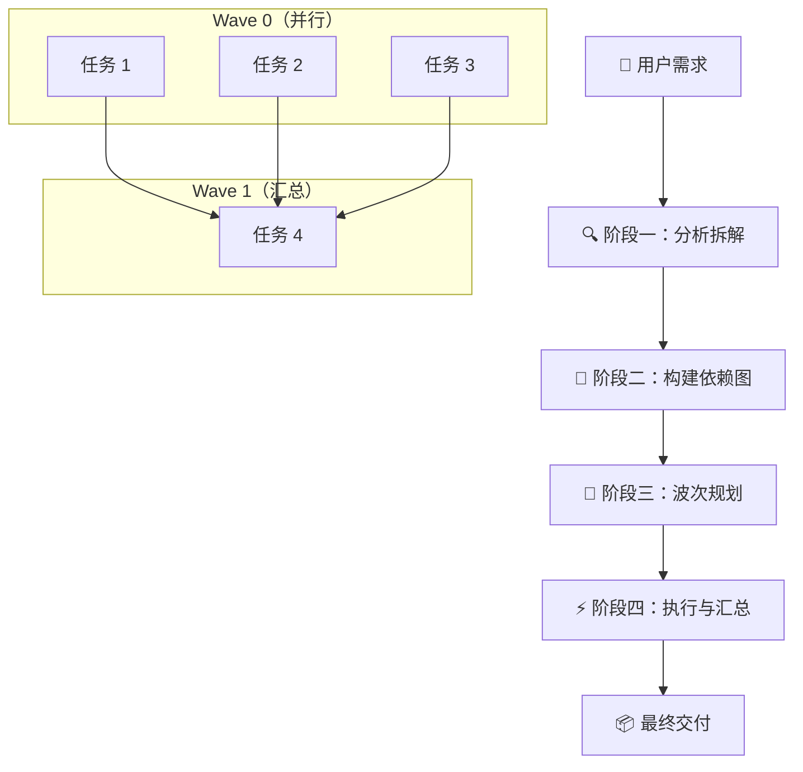

<div align="center">


**不要一次只做一件事。拆解、并行、编排。**

[](LICENSE)
[](CHANGELOG.md)
[](https://github.com/YardonYan/task-skill-orchestrator)
[](#平台)
[](#文件结构)

**中文** · [English](README.en.md)

</div>

---

> 把一个复杂需求拆成有依赖关系的子任务 DAG，按波次并行派发给多个 Sub Agent 执行，最后汇总成统一交付物。

Stop doing one thing at a time. Decompose, parallelize, orchestrate.

## 目录

- [解决什么问题](#解决什么问题)
- [工作方式](#工作方式)
- [核心能力](#核心能力)
- [平台](#平台)
- [安装](#安装)
- [使用途径](#使用途径)
- [怎么调用](#怎么调用)
- [使用示例](#使用示例)
- [文件结构](#文件结构)
- [运行示例](#运行示例)
- [排错](#排错)
- [许可证](#许可证)

---

<a id="解决什么问题"></a>

## 解决什么问题

当 AI 面对一个复杂需求时——比如「调研三家公司并汇总成报告」，或者「整理桌面、清理系统垃圾、再备份重要文件」——默认做法是串行：先做 A，再做 B，再做 C。中间还夹着一次又一次的等待。

真正的瓶颈不是单个任务慢，而是它们本来互不依赖，却被排成了一条队。

**Task Orchestrator 改变这一点。** 它分析需求、拆成原子子任务、识别彼此依赖、构建有向无环图（DAG），再把互不依赖的子任务按波次并行派发。结果是更短的执行时间、更清晰的结构，以及每一步都可验证的中间产出。

<a id="工作方式"></a>

## 工作方式


整个链路分四步：

一、**分析拆解**。把用户需求切成粒度合理的原子子任务，并区分哪些独立、哪些有依赖。

二、**构建依赖图**。识别数据依赖、时序依赖和逻辑依赖，构造成 DAG，并验证图中没有环。

三、**波次规划**。对 DAG 做拓扑分层，同一层的任务互相独立，构成一个波次；生成执行计划交用户确认。

四、**执行与汇总**。每个波次内的任务同时派发给多个 Sub Agent，全部返回后验收，再进入下一波，最后合并为统一交付物。



一句话概括机制：**同一波次内可以并行，跨波次必须等待**。

<a id="核心能力"></a>

## 核心能力

- **自动拆解**：解析复杂需求并切分为原子子任务，不需要人工规划。
- **依赖感知 DAG**：识别子任务间的数据、时序与逻辑依赖，构建并验证有向无环图。
- **波次并行派发**：把互相独立的子任务分到同一波，由多个 Sub Agent 同时执行。
- **结果汇总**：收集全部子任务产出，优雅处理失败分支，合并为统一交付物。
- **多 Agent 路由**：按任务类型自动路由到对应的 Sub Agent（file-agent、search-agent、browser、app-agent、computer-agent）。

<a id="平台"></a>

## 平台

**主要平台**：OpenClaw（通过 `sessions_spawn` 派发子 Agent）。

可适配 Claude Code 或其他具备子 Agent 能力的平台。平台无关的 DAG 引擎见 `scripts/orchestrate.py`。

<a id="安装"></a>

## 安装

### 用安装器（推荐）

仓库自带一个零依赖的安装脚本，装到本机各个 AI 应用的 skills 目录，不需要手工拷贝：

```bash
node tools/install.mjs --list                 # 看有哪些目标可选
node tools/install.mjs --ai openclaw          # 装到 OpenClaw
node tools/install.mjs --ai workbuddy --ai trae-cn   # 一次装多个
node tools/install.mjs --ai all               # 装到全部目标
node tools/install.mjs --ai all --dry-run     # 只预览，不写文件
node tools/install.mjs --ai openclaw --uninstall    # 卸载
```

已核对存在的目标：OpenClaw、WorkBuddy、TRAE 国内版、CodeBuddy、Claude Code、Codex CLI、Qwen Code、cc-switch。`cursor` 与通用 `.agents` 用的是通行约定，未在本机核对。

### 作为插件安装（WorkBuddy / CodeBuddy / Claude Code）

仓库根目录带 `.codebuddy-plugin/` 与 `.claude-plugin/` 两份清单，可以直接注册成一个「单插件市场」，在应用里按插件方式安装，不用手工拷目录。

清单的字段名与取值是照着应用自带的插件清单写的，不是自己发明的格式。**文件格式已逐字段对照应用自带的市场核对；注册与加载的端到端流程未做验证**，注册入口以你所装版本的界面为准。

改过 `SKILL.md` 的 name 或版本号之后重新生成：

```bash
node tools/build_plugins.mjs .
```

### OpenClaw 手工安装

```bash
# macOS / Linux
cp -r task-skill-orchestrator ~/.qclaw/skills/
```

```powershell
# Windows (PowerShell)
Copy-Item -Recurse task-skill-orchestrator $env:USERPROFILE\.qclaw\skills\
```

或通过 SkillHub：

```bash
openclaw skill install task-skill-orchestrator
```

<a id="怎么调用"></a>

## 使用途径

使用方式取决于你用哪个 AI 助手。同一台机器上装到多个助手是允许的，互相不冲突。

### 一条命令装到任意助手

仓库自带零依赖安装器，不用手工拷贝目录：

```bash
git clone https://github.com/YardonYan/task-skill-orchestrator.git
cd task-skill-orchestrator
node tools/install.mjs --list          # 看本机有哪些目标可选
node tools/install.mjs --ai workbuddy  # 装到某一个
node tools/install.mjs --ai all        # 一次装到全部
```

### 各助手对应的目录

| 目标 id | 助手 | 全局目录 | 项目内目录 |
| --- | --- | --- | --- |
| `workbuddy` | WorkBuddy | `~/.workbuddy/skills` | `.workbuddy/skills` |
| `trae-cn` | TRAE 国内版 | `~/.trae-cn/skills` | `.trae-cn/skills` |
| `codebuddy` | CodeBuddy | `~/.codebuddy/skills` | `.codebuddy/skills` |
| `claude` | Claude Code | `~/.claude/skills` | `.claude/skills` |
| `codex` | Codex CLI | `~/.codex/skills` | `.codex/skills` |
| `openclaw` | OpenClaw | `~/.openclaw/workspace/skills` | `.openclaw/skills` |
| `qwen` | Qwen Code | `~/.qwen/skills` | `.qwen/skills` |
| `cc-switch` | cc-switch | `~/.cc-switch/skills` | `.cc-switch/skills` |
| `cursor` | Cursor | `~/.cursor/skills` | `.cursor/skills` |
| `agents` | 通用 Agent 标准 | `~/.agents/skills` | `.agents/skills` |

不加参数装全局目录（所有项目可用），加 `--project` 装当前项目的相对目录（适合随项目提交、团队共享）。

### 作为插件安装

仓库根目录带四套插件清单，可以直接被支持插件市场的助手装走，不需要手工拷目录：

| 助手 | 清单位置 | 装法 |
| --- | --- | --- |
| Claude Code | `.claude-plugin/` | `/plugin marketplace add YardonYan/task-skill-orchestrator` 后 `/plugin install task-skill-orchestrator@YardonYan-task-skill-orchestrator` |
| WorkBuddy / CodeBuddy | `.codebuddy-plugin/` | 在插件管理的市场设置里添加本仓库路径或地址 |
| Codex | `.codex-plugin/` | 按 Codex 的插件安装流程指向本仓库 |
| Cursor | `.cursor-plugin/` | `/add-plugin` 或在插件市场里搜索 |

清单的字段名与取值是照着各助手自带的插件清单写的，不是自己发明的格式。**清单文件已逐字段对照核对；插件市场的注册与加载端到端流程未做验证**，入口以你所装版本的界面为准。

### 不适用这些场景

有几种环境问了但没有对应机制，说明如下，免得白折腾：

| 场景 | 情况 |
| --- | --- |
| 网页 IDE（CodeSandbox、StackBlitz、Replit） | 技能是给 AI 助手读的指令文件，不是可运行的应用，这些环境没有对应的加载入口 |
| 云主机 / 云 Shell（Google Cloud Shell、AWS CloudShell） | 同上。如果只是想跑仓库里的脚本，直接 `git clone` 后照文档执行命令即可，跟技能加载是两回事 |
| 把仓库 ZIP 直接上传到助手的技能上传框 | 仓库含参考资料与脚本，文件数可能超限；改用安装器或插件市场更稳 |
| 手机上使用 | 上述助手基本没有移动端 |

---

## 怎么调用

在对话中使用以下任一表达即可触发：

| 中文 | English |
|------|---------|
| 并行处理 | handle these in parallel |
| 同时做这些 | do all of these at once |
| 拆任务 | split this task |
| 多线并进 | multi-thread this |
| 批量执行 | batch execute |
| 复杂任务拆解 | decompose this complex task |

<a id="使用示例"></a>

## 使用示例

例一，有依赖的场景：

```
用户：帮我调研特斯拉、比亚迪、蔚来三家公司的 2025 年市场份额、核心技术和最新财报，最后汇总成对比报告

Agent：
拆解完成。4 个子任务，2 个波次。

Wave 0（并行，3 个任务）：
  ① 调研特斯拉 2025 市场份额、核心技术、财报 → search-agent
  ② 调研比亚迪 2025 市场份额、核心技术、财报 → search-agent
  ③ 调研蔚来   2025 市场份额、核心技术、财报 → search-agent

Wave 1（汇总，依赖 Wave 0 全部完成）：
  ④ 合并三份调研结果，产出对比报告 → file-agent

是否开始执行？

用户：执行

[Agent 并行派发 ①②③，等待全部返回，再派发 ④]
[产出：car_companies_comparison_report.md]
```

例二，完全独立的场景：

```
用户：同时帮我做三件事：整理桌面文件、清理系统垃圾、备份 D 盘重要文件到 E 盘

Agent：
拆解完成。3 个子任务，1 个波次。
（三者互相独立，无依赖关系。）

Wave 0（并行，3 个任务）：
  ① 整理桌面文件 → file-agent
  ② 清理系统垃圾 → computer-agent
  ③ 备份 D 盘重要文件到 E 盘 → file-agent

是否开始执行？
```

<a id="文件结构"></a>

## 文件结构

```
task-skill-orchestrator/
├── SKILL.md                  # 核心技能指令
├── .codebuddy-plugin/              插件清单（WorkBuddy / CodeBuddy）
├── .codex-plugin/                  插件清单（Codex）
├── .cursor-plugin/                 插件清单（Cursor）
├── .claude-plugin/                 插件清单（Claude Code）
├── README.md                 # 中文说明（本文件）
├── README.en.md              # English README
├── CHANGELOG.md              # 版本历史
├── CONTRIBUTING.md           # 贡献指南
├── LICENSE                   # Apache-2.0 许可证
├── meta.json                 # 技能元数据
├── assets/
│   ├── dag-waves.png         # 分波并行机制图
│   └── pipeline.png          # 四阶段流水线图
├── examples/
│   └── parallel_research.py  # 可运行示例，演示 DAG 逻辑
├── scripts/
│   └── orchestrate.py        # 平台无关的 DAG 引擎
├── tests/
│   └── test_orchestrator.py  # DAG 逻辑单元测试
└── tools/
│  ├── gen_readme_images.py  # 生成 README 配图（Pillow）
│  └── build_plugins.mjs       生成插件清单
```

<a id="运行示例"></a>

## 运行示例

```bash
cd examples
python parallel_research.py
```

输出：

```
============================================================
用户需求：帮我调研特斯拉、比亚迪、蔚来三家公司的 2025 年市场份额...
============================================================

[阶段一] 分析拆解...
4 个子任务：
  [T1] 调研特斯拉 2025 市场份额、核心技术、财报
  [T2] 调研比亚迪 2025 市场份额、核心技术、财报
  [T3] 调研蔚来   2025 市场份额、核心技术、财报
  [T4] 合并三份调研结果，产出对比报告

[阶段二] 构建依赖图...
依赖关系：
  T1 → T4
  T2 → T4
  T3 → T4

[阶段三] 波次规划...
  Wave 0: T1, T2, T3
  Wave 1: T4

============================================================
执行计划：
============================================================
拆解完成。4 个子任务，2 个波次。

Wave 0（并行，3 个任务）：
  • [T1] 调研特斯拉... → search-agent
  • [T2] 调研比亚迪... → search-agent
  • [T3] 调研蔚来...   → search-agent

Wave 1（汇总）：
  • [T4] 合并三份调研结果 → file-agent

是否开始执行？
============================================================
```

## 排错

### 装好了但对话里没反应

按顺序查三件事：

一、**`SKILL.md` 是否在技能目录的根层。** 正确结构是 `<应用技能目录>/task-skill-orchestrator/SKILL.md`。如果多套了一层目录，应用扫不到。

二、**重启应用。** 多数应用只在启动时扫描技能目录。

三、**确认目录是该应用真正会扫的那个。** 跑 `node tools/install.mjs --list` 看清单。

### 说了「并行处理」，模型还是自己一个个做

模型可能绕过技能、临时写脚本串行执行。触发词要用明白些，一次说清要并行：

```
这几件事互相独立，请用并行处理，先给我执行计划再动手
```

技能被设计成「先出计划、等确认、再派发」，所以看到计划就说明已经接管了。如果连计划都没有，就是没触发。

### `python scripts/orchestrate.py` 卡住不动

它在等 stdin。这个脚本从标准输入读 DAG 的 JSON，直接运行会一直挂着。正确用法：

```bash
echo '{"tasks":[{"id":"T1","description":"调研特斯拉"},{"id":"T2","description":"合并报告","depends_on":["T1"]}]}' | python scripts/orchestrate.py
```

只想看用法说明就跑 `python scripts/orchestrate.py --help`。

### 同一波次里的任务顺序和我写的不一样

正常。同波任务本来就是并行执行的，顺序没有意义；输出按任务 id 自然序排列（`T1 T2 ... T9 T10`），只是为了每次运行结果一致、方便比对。跨波次的顺序则是严格的，第 N+1 波必须等第 N 波全部返回。

### 单元测试没有任何输出

测试文件是 pytest 风格，直接 `python tests/test_orchestrator.py` 不会有任何反应。用 pytest 跑：

```bash
python -m pytest tests/test_orchestrator.py -v
```

当前共 16 个用例。

### 目标平台没有 Sub Agent 能力

技能在 OpenClaw 上用 `sessions_spawn` 派发子 Agent。如果目标平台不支持并行子 Agent，波次计划仍然可用来理清依赖和顺序，只是同波任务会退化成串行执行——结构上的收益（拆解、依赖可视化、可验证的中间产出）仍然保留。

---

## 贡献

欢迎提交 Issue 和 PR，请先阅读 [CONTRIBUTING.md](CONTRIBUTING.md)。

## 版本

完整版本历史见 [CHANGELOG.md](CHANGELOG.md)。

- **v1.0.0**（2026-05-25）：初始版本。核心四阶段流水线：拆解 → 依赖图 → 波次派发 → 汇总。

<a id="许可证"></a>

## 许可证

**Apache-2.0** —— 自由使用、修改、分发，需保留署名与协议声明。完整条款见 [LICENSE](LICENSE)。

Copyright 2026 YardonYan
