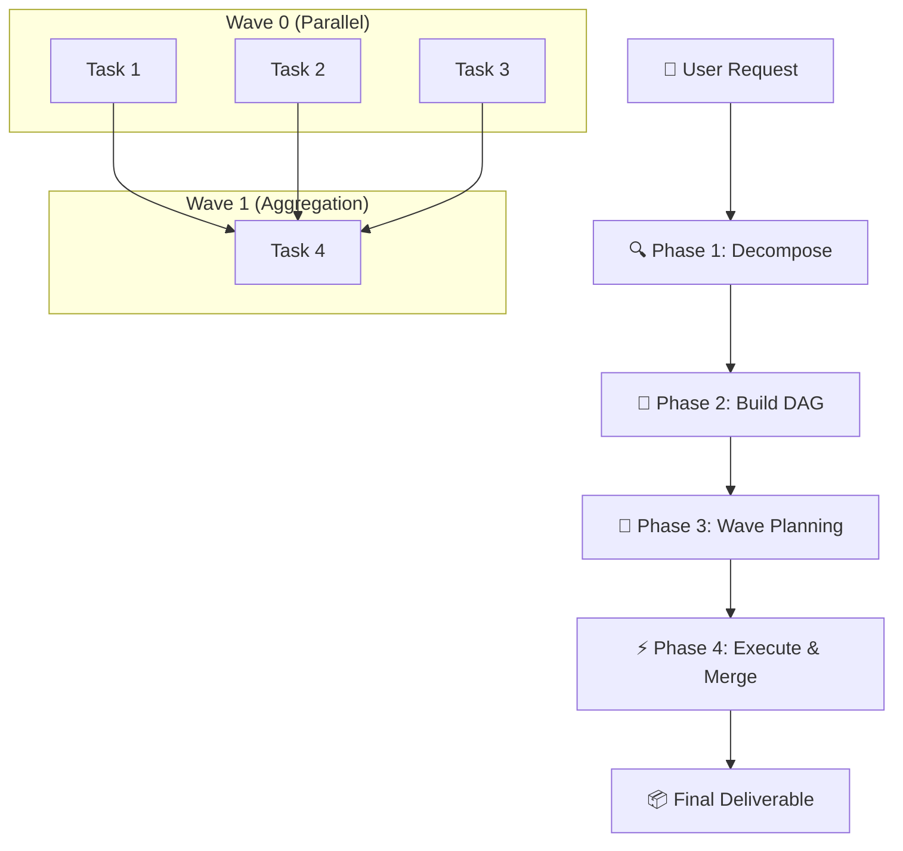

# Task Skill Orchestrator / 任务编排大师

> **Stop doing one thing at a time. Decompose, parallelize, orchestrate.**
> **不要一次只做一件事。拆解、并行、编排。**

A skill for decomposing complex user requests into a dependency-aware DAG of subtasks, dispatching them in parallel waves to multiple Sub Agents, and aggregating results into a unified deliverable.

一个用于将复杂用户需求拆解为有依赖关系的子任务 DAG、分波次并行派发给多个 Sub Agent 执行、最后汇总为统一交付成果的技能。

> **Adapted from [parallel-task by am-will](https://github.com/am-will/codex-skills)** — the foundational work that pioneered wave-based parallel task orchestration with dependency management.
> **改编自 [am-will 的 parallel-task](https://github.com/am-will/codex-skills)** —— 开创基于波次的并行任务编排与依赖管理的基础性工作。

[](https://github.com/YardonYan/task-skill-orchestrator)
[](LICENSE)

---

## What This Is / 这是什么

When an AI faces a complex request — like "research three companies and merge into a report" or "clean up my desktop, clear system junk, and back up important files" — the default approach is sequential: do A, then B, then C. This is slow.

当 AI 面对复杂需求时——比如「调研三家公司并汇总成报告」或「整理桌面、清理垃圾、备份文件」——默认做法是串行：先做 A，再做 B，再做 C。这很慢。

**Task Orchestrator changes this.** It analyzes the request, breaks it into atomic subtasks, identifies dependencies between them, builds a directed acyclic graph (DAG), and dispatches independent subtasks in parallel waves. The result: faster execution, clearer structure, and verifiable intermediate outputs.

**Task Orchestrator 改变了这一点。** 它分析需求、拆解为原子子任务、识别依赖关系、构建有向无环图（DAG），并将独立子任务按波次并行派发。结果：更快的执行速度、更清晰的结构、可验证的中间产出。

### Four-Phase Pipeline / 四阶段流水线



```
User Request / 用户需求
        │
        ▼
┌─────────────────────────┐
│ Phase 1: Decompose      │  Analyze → split into atomic subtasks → classify
│ 阶段一：分析拆解          │  分析 → 原子拆分 → 独立/依赖分类
└───────────┬─────────────┘
            │
            ▼
┌─────────────────────────┐
│ Phase 2: Build DAG      │  Identify dependencies → construct graph → validate
│ 阶段二：构建依赖图        │  识别依赖 → 构建有向无环图 → 验证无循环
└───────────┬─────────────┘
            │
            ▼
┌─────────────────────────┐
│ Phase 3: Wave Planning  │  Topological sort → generate plan → user confirms
│ 阶段三：波次规划          │  拓扑分层 → 生成计划 → 用户确认
└───────────┬─────────────┘
            │
            ▼
┌─────────────────────────┐
│ Phase 4: Execute & Merge│  Parallel dispatch per wave → verify → aggregate
│ 阶段四：执行与汇总        │  每波并行派发 → 验收 → 汇总合并
└─────────────────────────┘
```


---

## Features / 特性

- **Automatic decomposition / 自动拆解**: Parses complex user requests and splits into atomic subtasks — no manual planning required. / 解析复杂用户需求，自动拆分为原子子任务，无需手动规划。
- **Dependency-aware DAG / 依赖感知 DAG**: Identifies data, temporal, and logical dependencies between subtasks. Builds and validates a directed acyclic graph. / 识别子任务间的数据、时序和逻辑依赖，构建并验证有向无环图。
- **Parallel wave dispatch / 波次并行派发**: Groups independent subtasks into waves. All tasks in a wave execute in parallel via multiple Sub Agents. / 将独立子任务分波，同波内所有任务通过多个 Sub Agent 并行执行。
- **Result aggregation / 结果汇总**: Collects all subtask outputs, handles failures gracefully, merges into a unified final deliverable. / 收集所有子任务产出，优雅处理失败，合并为统一最终交付成果。
- **Multi-agent routing / 多 Agent 路由**: Automatically routes each subtask to the correct Sub Agent (file-agent, search-agent, browser, app-agent, computer-agent). / 自动将每个子任务路由到正确的 Sub Agent。

---

## Platform / 平台

**Primary**: OpenClaw (uses `sessions_spawn` for sub-agent dispatch)

**主要平台**：OpenClaw（使用 `sessions_spawn` 进行子 Agent 派发）

> Can be adapted for Claude Code or other platforms. See `scripts/orchestrate.py` for a platform-agnostic DAG engine.
> 可适配 Claude Code 或其他平台。平台无关的 DAG 引擎见 `scripts/orchestrate.py`。

## Installation / 安装

### For OpenClaw

```bash
# macOS / Linux
cp -r task-skill-orchestrator ~/.qclaw/skills/
```

```powershell
# Windows (PowerShell)
Copy-Item -Recurse task-skill-orchestrator $env:USERPROFILE\.qclaw\skills\
```

Or via SkillHub / 或通过 SkillHub：

```bash
openclaw skill install task-skill-orchestrator
```

---

## Usage / 使用方式

Trigger this skill by using any of the following keywords in conversation / 在对话中使用以下关键词即可触发：

| English / 英文 | 中文 |
|--------|------|
| "handle these in parallel" | 「并行处理」 |
| "do all of these at once" | 「同时做这些」 |
| "split this task" | 「拆任务」 |
| "multi-thread this" | 「多线并进」 |
| "batch execute" | 「批量执行」 |
| "decompose this complex task" | 「复杂任务拆解」 |

### Example / 示例

```
User: 帮我调研特斯拉、比亚迪、蔚来三家公司的 2025 年市场份额、核心技术和最新财报，最后汇总成对比报告

Agent:
Decomposition complete. 4 subtasks, 2 waves.

Wave 0 (parallel, 3 tasks):
  ① Research Tesla 2025 market share, core tech, financials → search-agent
  ② Research BYD 2025 market share, core tech, financials → search-agent
  ③ Research NIO 2025 market share, core tech, financials → search-agent

Wave 1 (aggregation, depends on all Wave 0):
  ④ Merge three research results into comparison report → file-agent

Proceed with execution?

User: 执行

[Agent dispatches T1/T2/T3 in parallel, waits for results, then dispatches T4]
[Output: car_companies_comparison_report.md]
```

Another example / 另一个示例：

```
User: 同时帮我做三件事：整理桌面文件、清理系统垃圾、备份 D 盘重要文件到 E 盘

Agent:
Decomposition complete. 3 subtasks, 1 wave.
(All three are independent — no dependencies.)

Wave 0 (parallel, 3 tasks):
  ① 整理桌面文件 → file-agent
  ② 清理系统垃圾 → computer-agent
  ③ 备份 D 盘重要文件到 E 盘 → file-agent

Proceed with execution?
```

---

## File Structure / 文件结构

```
task-skill-orchestrator/
├── SKILL.md                 # Core skill instructions / 核心技能指令
├── README.md                # This file / 本文件
├── CHANGELOG.md             # Version history / 版本历史
├── CONTRIBUTING.md          # Contribution guide / 贡献指南
├── meta.json                # Skill metadata / 技能元数据
├── LICENSE              # Apache 2.0 License / Apache 2.0 许可证
├── .gitignore               # Git ignore rules / Git 忽略规则
├── examples/
│   └── parallel_research.py # Runnable example demonstrating DAG logic / 可运行示例
├── scripts/
│   └── orchestrate.py       # Platform-agnostic DAG engine / 平台无关的 DAG 引擎
└── tests/
    └── test_orchestrator.py # Unit tests for DAG logic / DAG 逻辑单元测试
```

---

## Running the Example / 运行示例

```bash
cd examples
python parallel_research.py
```

Output / 输出：

```
============================================================
User request: 帮我调研特斯拉、比亚迪、蔚来三家公司的 2025 年市场份额...
============================================================

[Phase 1] Decomposition...
4 subtasks:
  [T1] Research Tesla 2025 market share, core tech, financials
  [T2] Research BYD 2025 market share, core tech, financials
  [T3] Research NIO 2025 market share, core tech, financials
  [T4] Merge three research results into comparison report

[Phase 2] DAG Construction...
Dependencies:
  T1 → T4
  T2 → T4
  T3 → T4

[Phase 3] Wave Planning...
  Wave 0: T1, T2, T3
  Wave 1: T4

============================================================
Execution Plan:
============================================================
Decomposition complete. 4 subtasks, 2 waves.

Wave 0 (parallel, 3 tasks):
  • [T1] Research Tesla... → search-agent
  • [T2] Research BYD... → search-agent
  • [T3] Research NIO... → search-agent

Wave 1 (aggregation):
  • [T4] Merge three research results → file-agent

Proceed with execution?
============================================================
```

---

## Contributing / 贡献

Issues and PRs are welcome! Please read [CONTRIBUTING.md](CONTRIBUTING.md) for guidelines.
欢迎提交 Issue 和 PR！请阅读 [CONTRIBUTING.md](CONTRIBUTING.md) 了解贡献指南。

## Version / 版本

See [CHANGELOG.md](CHANGELOG.md) for full history. / 完整版本历史见 [CHANGELOG.md](CHANGELOG.md)。

- **v1.0.0** (2026-05-25): Initial release. Core four-phase pipeline: decompose → DAG → wave dispatch → aggregate. / 初始版本。核心四阶段流水线：拆解→依赖图→波次派发→汇总。

## License / 许可证

Apache 2.0 — see [LICENSE](LICENSE) for details. / 详见 [LICENSE](LICENSE)。